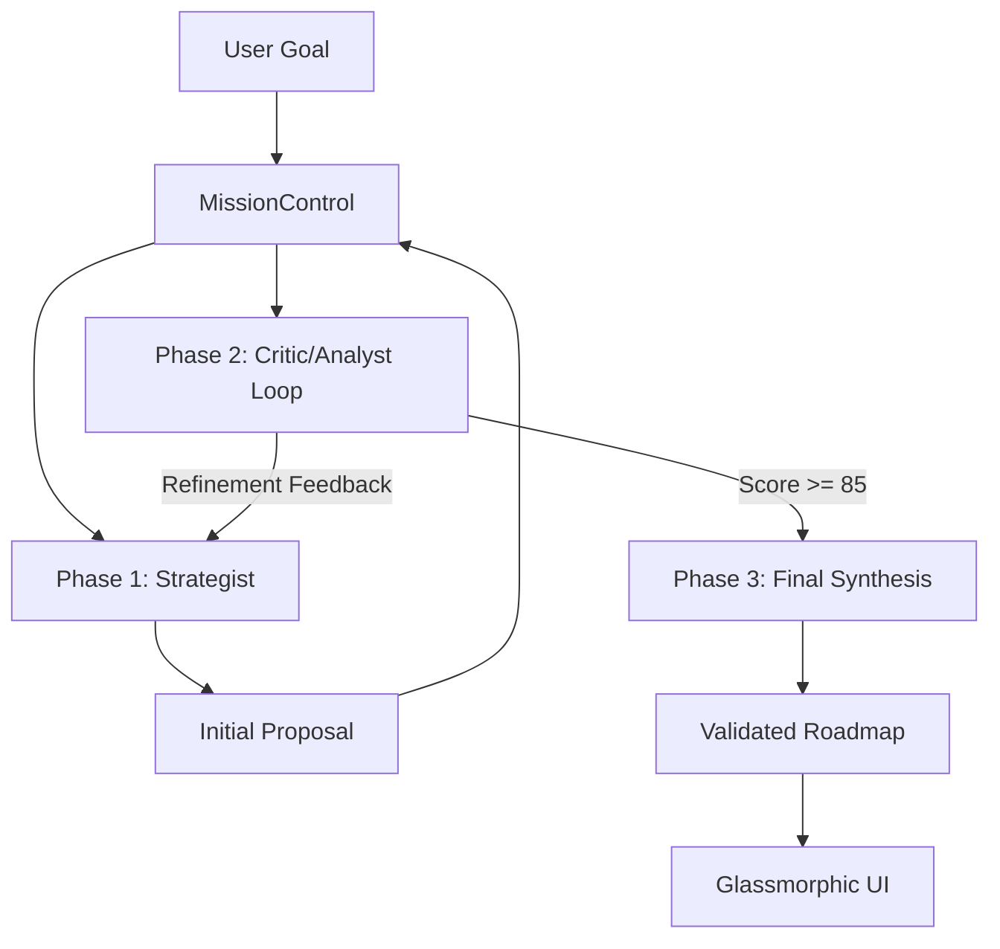

# 🤖 Atlas Agent Development Kit (ADK) v3.6.3

## Executive Summary

The **Atlas Agent Development Kit (ADK)** is a production-ready multi-agent orchestration framework designed for enterprise strategic planning. It implements a collaborative synthesis pipeline where specialized AI agents work together to transform C-level directives into executable 2026 quarterly roadmaps. v3.6.3 continues the **Zero Warning Baseline**, strictly enforced result interfaces, and formalized identity sync between code and reasoning.

---

## 🏗️ Architecture Overview

### Multi-Agent Synthesis Pipeline

The pipeline uses a **three-agent swarm** with iterative refinement. MissionControl orchestrates the flow, ensuring the Strategist's plans are validated by the Analyst and optimized by the Critic until an acceptance threshold (Score >= 85) is met or 3 iterations are reached.



### Layered Service Architecture

All external integrations and core utilities are built on a robust service layer:
- **RetryableAPIService**: Base class providing exponential backoff, retry logic, and batch-based concurrency control (limited to 3 concurrent requests) to prevent rate limiting.
- **Persistence Layer**: Type-safe storage with atomic write protection and data obfuscation.

### Core Directory Structure

```
src/
├── components/          # Categorized UI Components
│   ├── ui/             # Glassmorphic primitives (A2UIRenderer.tsx, TaskIcons.tsx)
│   ├── views/          # Dashboard modules (DependencyGraph, Timeline)
│   ├── cards/          # Specialized domain components (TaskCard)
│   └── core/           # Framework components (BootOrchestrator.tsx, AtlasErrorBoundary.tsx)
├── lib/
│   ├── adk/            # Agent Development Kit (Core Orchestration)
│   │   ├── agents.ts   # Agent implementations
│   │   ├── factory.ts  # Agent instantiation & pooling
│   │   ├── orchestrator.ts # MissionControl logic
│   │   ├── protocol.ts # A2UI Protocol v1.1
│   │   ├── uiBuilder.ts # Fluent API for UI
│   │   └── exporter.ts # Mermaid/JSON export
│   └── utils.ts        # Centralized utilities (cn helper)
├── services/           # Layered services
│   ├── ai/             # Gemini 2.0 Flash integration (gemini.ts)
│   ├── integrations/   # External APIs (github.com, jira.ts)
│   └── core/           # Data persistence, base classes (PersistenceService.ts, RetryableAPIService.ts)
├── config/             # System Configuration & Constants
├── styles/             # Global Tailwind v4 styles (index.css)
├── types/              # Global TypeScript Definitions (atlas.d.ts)
├── test/               # Integration, Smoke & Unit Tests (App.test.tsx, setup.ts)
```

---

## 🧱 Core Service Implementations

### 1. PersistenceService (`src/services/core/persistence.ts`)
- **Atomic Operations**: Uses a custom `Mutex` and non-recursive `processQueue` to handle asynchronous `localStorage` writes, preventing race conditions.
- **Security**: Implements XOR-based obfuscation (key `0xaa`) combined with Base64 encoding for client-side secret storage to maintain backward compatibility.
- **Quota Management**: Proactively monitors storage usage (5MB limit) and surfaces warnings when >90% capacity is reached.

### 2. MissionControl (`src/lib/adk/orchestrator.ts`)
- **Failure Simulation**: Includes a `simulateFailure` engine that calculates impact cascades across the DAG, identifying high-priority risks.
- **Swarm Logic**: Orchestrates the multi-agent loop (Strategist → Analyst → Critic) with iterative feedback injection until Score >= 85.
- **Agent Lifecycle**: `AgentFactory` (`src/lib/adk/factory.ts`) manages a static pool of 10 agents and provides a `dispose()` method for memory cleanup.

### 3. Integration Layer (`src/services/integrations/`)
- **RetryableAPIService**: Base class providing exponential backoff and batch-based concurrency control.
- **GitHub**: Automated milestone creation (Q1-Q4) and project board linking via `addToProject`.
- **Jira**: Bidirectional ticket discovery via encoded JQL and automated linking of stories to quarterly epics.
- **Concurrency**: Inherits from `RetryableAPIService` to enforce batch-based processing (max 3 concurrent requests).

---

## 🎭 Agent Personas

### 1. The Strategist Agent 🧠
**Role**: Hierarchical goal decomposition and dependency graph construction.
- **Decomposition**: Breaks directives into 15-30 granular subtasks.
- **Iterative Refinement**: Re-processes plans based on Critic feedback to resolve dependency cycles or capacity issues.
- **Alignment**: Maps tasks to 2026 quarters and TASK_BANK themes.

### 2. The Analyst Agent 📊
**Role**: Feasibility scoring and risk assessment.
- **Scoring**: Calculates feasibility (0-100) based on task complexity and resource distribution.
- **Bottlenecks**: Identifies critical path risks and Q1 capacity overloads (max 12 HIGH priority tasks).
- **Validation**: Provides quantitative data for the Critic's qualitative assessment.

### 3. The Critic Agent 🔍
**Role**: DAG validation and plan optimization.
- **DAG Integrity**: Strictly enforces acyclic graph constraints (no circular dependencies).
- **Optimization**: Suggests task re-sequencing for maximum parallel execution.
- **Gatekeeper**: Enforces the 85-point acceptance threshold for MissionControl synthesis.

---

## 🛠️ Development & Build Commands

```bash
# Install dependencies
npm install

# Start development server
npm run dev

# Build for production
npm run build

# Run tests
npm test

# Generate coverage report (85% threshold)
npm run coverage

# Linting & Formatting
npm run lint
npm run format
npm run type-check
```

---

## ⚠️ Guardrails & Conventions

### 1. Zero Warning Baseline
Maintain the **Zero Warning Baseline**. All PRs must pass `npm run lint`, `npm run type-check`, and `npm test` with 0 warnings or errors.
- **ESLint**: Pinned to `v9.17.0` to avoid peer dependency conflicts with `eslint-plugin-react`.
- **Type Safety**: Avoid non-null assertions (`!`). Use proper null checks or exhaustive error handling.
- **Fast Refresh**: Separate functional components from static constants (e.g., icons in `src/components/ui/TaskIcons.tsx`).

### 2. Dependency Management
- **Zod**: Included in `package.json` but currently unused in source. Zod-based runtime validation for LLM outputs is a planned enhancement.
- Prefer stable, widely adopted versions.
- Do not introduce new dependencies without justification.

### 3. Coding Conventions
- Use **TypeScript** strictly; avoid `any`.
- **TS 6.0 Compatibility**: The project uses `"ignoreDeprecations": "6.0"` in `tsconfig.json` to maintain support for the `baseUrl` property.
- Utilize the `cn` helper from `@lib/utils` for Tailwind class merging.
- **Tailwind v4**: The project uses CSS-first configuration via `@theme` and `@utility` in `src/styles/index.css`. Use `@tailwindcss/postcss` for processing.
- Follow the categorized component structure: `ui/`, `views/`, `cards/`.
- Keep services stateless; fetch configuration from `persistenceService` on each call.

### 4. Build Configuration (Vite 8)
- **manualChunks**: Must use the functional API in `vite.config.ts` for strict typing and correct chunking strategy.
- **Compression**: Gzip/Brotli compression is enabled via `vite-plugin-compression` for production builds.
- **Security**: CSP is implemented in `index.html`. Production builds disable sourcemaps.

### 5. A2UI Protocol
- Follow the **A2UI Protocol v1.1** for streaming UI components.
- Use the `UIBuilder` fluent API for constructing A2UI messages.
- Ensure all glassmorphic components adhere to the design system (backdrop-blur, glass-1/2).

### 6. AI Identity Sync
- The application version must be synchronized with the AI's system instruction in `src/config/system.ts`.
- The agent core must remain aware of current library capabilities and protocol versions.

---

## 🛑 Known Pitfalls & Solutions

- **Circular Imports**: Avoid importing from barrel files (`index.ts`) within the same directory. Import from specific sub-modules instead.
- **Vite 8 Warnings**: To avoid `INEFFECTIVE_DYNAMIC_IMPORT` warnings in barrel files, do not dynamically import local modules that are also statically exported in the same file.
- **Gemini Race Condition**: Always wrap the entire `generateContent` call in `Promise.race` for timeouts, not just the response property.
- **Persistence Mutex**: When using the `lock()` method, ensure the `begin` variable uses a definite assignment assertion (`!`) to pass strict initialization checks.
- **Error Handling**: Surface actual error messages to the user in catch blocks to aid production debugging.
- **React 19 Compatibility**: Ensure all third-party libraries and custom components are compatible with React 19's rendering behavior.

---

## 🧪 Testing Strategy

- **Threshold**: 85% coverage for Lines, Functions, Branches, and Statements. Strictly enforced in `vitest.config.ts`.
- **Infrastructure**: Shared test helpers and mock plans are housed in `src/test/test-utils.ts` to ensure stability across the multi-agent swarm.
- **Setup**: `src/test/setup.ts` provides a global Vitest environment with mocks for `ResizeObserver`, `crypto`, and A2UI serializers. It must remain decoupled from test imports to prevent internal suite corruption.
- **Service Mocks**: The test suite uses comprehensive mock implementations for core services to achieve high reliability.
- **Integration**: `src/test/smoke.test.ts` verifies the full multi-agent pipeline.
- **Frontend Verification**: A mock `.env` file with `VITE_GEMINI_API_KEY` is required for local verification of the `BootLoader` transition (2.6s - 5s).

---

<div align="center">

**Atlas Agent Development Kit v3.6.3**

*Powered by Google Gemini 2.0 Flash*

[README.md](./README.md) | [CHANGELOG.md](./CHANGELOG.md) | [Documentation](https://github.com/darshil0/atlas-strategic-agent/wiki)

</div>
