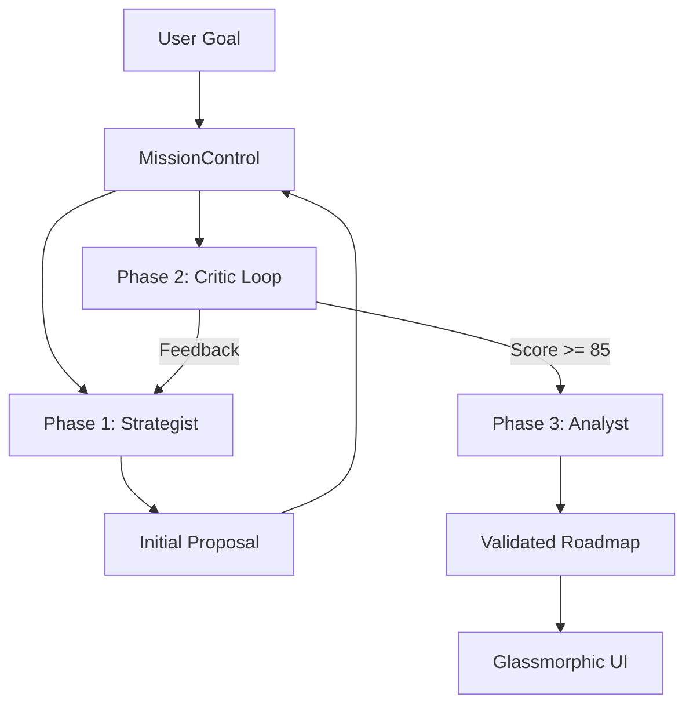

# 🤖 Atlas Agent Development Kit (ADK) v3.6.0

## Executive Summary

The **Atlas Agent Development Kit (ADK)** is a production-ready multi-agent orchestration framework designed for enterprise strategic planning. It implements a collaborative synthesis pipeline where specialized AI agents work together to transform C-level directives into executable 2026 quarterly roadmaps. v3.6.0 continues the **Zero Warning Baseline**, strictly enforced result interfaces, and formalized identity sync between code and reasoning.

---

## 🏗️ Architecture Overview

### Multi-Agent Synthesis Pipeline



### Core Directory Structure

```
src/
├── components/          # Categorized UI Components
│   ├── ui/             # A2UI glassmorphic primitives (A2UIRenderer.tsx)
│   ├── views/          # Dashboard modules (DependencyGraph, Timeline)
│   └── cards/          # Specialized domain components (TaskCard)
├── lib/
│   ├── adk/            # Agent Development Kit (Core Orchestration)
│   │   ├── agents.ts   # Agent implementations
│   │   ├── factory.ts  # Agent instantiation & pooling
│   │   ├── orchestrator.ts # MissionControl logic
│   │   ├── protocol.ts # A2UI Protocol v1.1
│   │   ├── uiBuilder.ts # Fluent API for UI
│   │   └── exporter.ts # Mermaid/JSON export
│   └── utils.ts        # Centralized utilities (cn helper)
├── services/           # External API Integrations
│   ├── geminiService.ts # Gemini 2.0 Flash integration
│   ├── githubService.ts # GitHub Issues API
│   └── jiraService.ts   # Jira Cloud REST API
├── config/             # System Configuration & Constants
└── types/              # Global TypeScript Definitions
```

---

## 🎭 Agent Personas

### 1. The Strategist Agent 🧠
**Role**: Hierarchical goal decomposition and dependency graph construction.
- Decomposes directives into 15-30 granular subtasks.
- Applies 2026 Q1-Q4 quarterly sequencing.
- Aligns tasks with TASK_BANK themes (AI, Cyber, ESG, Global, Infra, People).

### 2. The Analyst Agent 📊
**Role**: Feasibility scoring and risk assessment.
- Calculates feasibility scores (0-100).
- Identifies critical path bottlenecks.
- Assesses Q1 capacity overload (max 12 HIGH priority tasks).

### 3. The Critic Agent 🔍
**Role**: DAG validation and plan optimization.
- Validates acyclic graph constraints (no circular dependencies).
- Optimizes task sequencing for parallel execution.
- Target score >= 85 for plan acceptance.

---

## 🛠️ Development & Build Commands

```bash
# Install dependencies
npm install

# Start development server
npm run dev

# Build for production
npm run build

# Run tests
npm test

# Generate coverage report (85% threshold)
npm run coverage

# Linting & Formatting
npm run lint
npm run format
npm run type-check
```

---

## ⚠️ Guardrails & Conventions

### 1. Zero Warning Baseline
Maintain the **Zero Warning Baseline**. All PRs must pass `npm run lint`, `npm run type-check`, and `npm test` with 0 warnings or errors.

### 2. Dependency Management
- Prefer stable, widely adopted versions.
- Do not introduce new dependencies without justification.
- Update lockfiles (`package-lock.json`) whenever dependencies change.

### 3. Coding Conventions
- Use **TypeScript** strictly; avoid `any`.
- Utilize the `cn` helper from `@lib/utils` for Tailwind class merging.
- Follow the categorized component structure: `ui/`, `views/`, `cards/`.
- Keep services stateless; fetch configuration from `persistenceService` on each call.

### 4. A2UI Protocol
- Follow the **A2UI Protocol v1.1** for streaming UI components.
- Use the `UIBuilder` fluent API for constructing A2UI messages.
- Ensure all glassmorphic components adhere to the design system (backdrop-blur, glass-1/2).

### 5. AI Identity Sync
- The application version must be synchronized with the AI's system instruction in `src/config/system.ts`.
- The agent core must remain aware of current library capabilities and protocol versions.

---

## 🛑 Known Pitfalls & Solutions

- **Circular Imports**: Avoid importing from barrel files (`index.ts`) within the same directory. Import from specific sub-modules instead.
- **Gemini Race Condition**: Always wrap the entire `generateContent` call in `Promise.race` for timeouts, not just the response property.
- **Error Handling**: Surface actual error messages to the user in catch blocks to aid production debugging.
- **React 19 Compatibility**: Ensure all third-party libraries and custom components are compatible with React 19's rendering behavior.

---

## 🧪 Testing Strategy

- **Threshold**: 85% coverage for Lines, Functions, Branches, and Statements.
- **Setup**: `src/test/setup.ts` contains necessary mocks for `scrollIntoView` and `crypto.randomUUID`.
- **Integration**: `smoke.test.ts` verifies the full multi-agent pipeline and factory instantiation.

---

<div align="center">

**Atlas Agent Development Kit v3.6.0**

*Powered by Google Gemini 2.0 Flash*

[README.md](./README.md) | [CHANGELOG.md](./CHANGELOG.md) | [Documentation](https://github.com/darshil0/atlas-strategic-agent/wiki)

</div>
