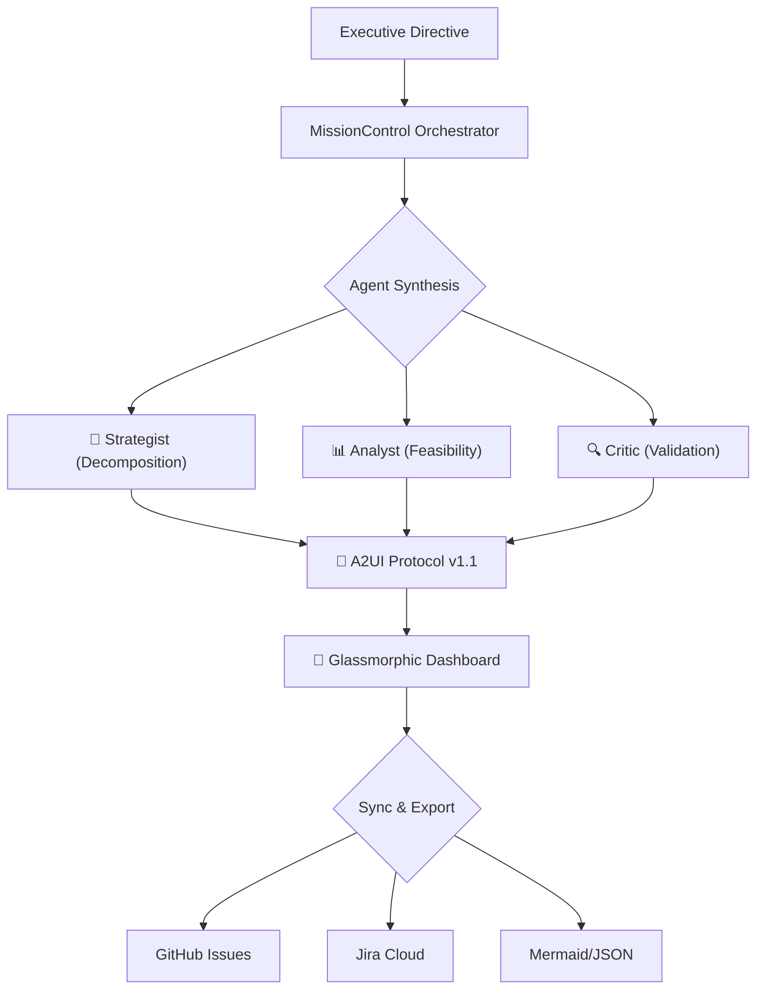

# 🌌 Atlas Strategic Agent v3.6.3


### *Executive Vision → Executable Enterprise Roadmaps*

**Atlas** is a production-ready multi-agent AI orchestrator that transforms high-level strategic directives into actionable 2026 quarterly roadmaps. Powered by **Google Gemini 2.0 Flash**, it features a collaborative "Mission Control" architecture with native GitHub Issues and Jira Cloud synchronization.

---

## 🎯 Executive Summary

Imagine you're a CEO who just declared, “I need to dominate the AI market in 2026!” Your leadership team nods enthusiastically—then everyone stares at each other wondering: *What does that actually mean? What do we build first? Who does what? When?*

**Atlas is the answer to that moment.**

It’s an AI-powered reality check that transforms ambitious “change the world” statements into executable quarterly roadmaps—complete with tasks, dependencies, risk assessments, and timeline validation.

> [!IMPORTANT]
> **Zero Warning Baseline**: v3.6.3 strictly enforces a zero-warning policy across TypeScript, ESLint, and Vitest, ensuring enterprise-grade stability and "technically pristine" execution.

---

## ✨ Key Capabilities

| Feature | Description | Stack |
| :--- | :--- | :--- |
| **A2UI Protocol v1.1** | Real-time streaming of glassmorphic UI directly from LLM reasoning | React 19 + Framer Motion |
| **What-If Engine** | Failure cascade modeling with risk scoring across the dependency DAG | Custom BFS DAG Analysis |
| **Enterprise Sync** | Native bidirectional synchronization with GitHub Issues and Jira Cloud | REST API v3 / ADF |
| **Glassmorphic UI** | Premium backdrop-blur design system for high-density strategic data | Tailwind 4.2 |
| **Persistence** | Mutex-guarded encrypted storage with atomic write protection | Custom Persistence Layer |
| **TaskBank** | 90+ pre-calculated 2026 strategic objectives (AI, Cyber, ESG, etc.) | Neural Alignment |

---

## 🏗️ Architecture: The Agent Development Kit (ADK)

Atlas implements a collaborative synthesis pipeline where specialized agents work together to ensure plan quality and technical feasibility.



### 🎭 Specialized Agent Personas

Think of these as three brutally honest consultants working 24/7 on your roadmap:

1.  **🎙️ The Strategist**: The visionary architect. Decomposes "North Star" goals into Q1-Q4 2026 workstreams with strict hierarchical dependencies.
2.  **📊 The Analyst**: The pragmatist. Performs feasibility scoring (0-100), identifies Q1 capacity bottlenecks, and aligns tasks with the **TASK_BANK**.
3.  **🔍 The Critic**: The gatekeeper. Stress-tests roadmaps for acyclic graph validation (no circular loops) and enforces the **85-point acceptance threshold**.

---

## 🧠 Technical Deep Dive

### 🧱 Core Service Layers

#### 1. Persistence & Atomic Writes
The `PersistenceService` implements a custom `Mutex` to ensure atomic operations on `localStorage`. It features XOR-based obfuscation (key `0xaa`) to protect secrets while maintaining client-side compatibility.

#### 2. MissionControl Orchestration
The swarm logic orchestrates the **Strategist → Analyst → Critic** loop. If the quality score falls below 85, the Critic's feedback is injected back into the Strategist for iterative refinement (capped at 3 iterations).

#### 3. Resilience & Concurrency
The `RetryableAPIService` base class provides exponential backoff and enforces a **batch limit of 3 concurrent requests** to prevent rate-limiting during large-scale enterprise synchronizations.

### 🚀 The Tech Stack: Engineering Decisions
*   **TypeScript (Strict)**: 100% compliance. Zero `any` usage.
*   **React 19**: Leverages concurrent rendering for fluid graph interactions.
*   **Tailwind CSS 4.2**: CSS-first configuration via `@theme` for a premium glassmorphic experience.
*   **Gemini 2.0 Flash**: Selected for its high-performance JSON output and 1M+ token context window.

---

## 🚀 Getting Started

### 1. Prerequisites
- **Node.js** 20+ (LTS)
- **Google Gemini API Key** ([Get your key](https://ai.google.dev/gemini-api/docs/api-key))

### 2. Quick Start
```bash
# Clone & Install
git clone https://github.com/darshil0/atlas-strategic-agent.git
cd atlas-strategic-agent
npm install

# Setup Environment
cp .env.example .env
# Add VITE_GEMINI_API_KEY to .env

# Launch
npm run dev
```

### 3. Development Commands
```bash
npm run dev              # Start dev server (localhost:3000)
npm run lint             # ESLint Zero Warning check
npm run type-check       # Strict TypeScript check
npm test                 # Run Vitest integration suite
```

---

## ⚠️ Guardrails & Conventions

> [!TIP]
> Maintain the **Zero Warning Baseline**. All pull requests must pass `lint`, `type-check`, and `test` with **zero warnings** or errors.

*   **Type Safety**: Never use non-null assertions (`!`). Use proper null checks or exhaustive error handling.
*   **Service Layer**: Keep services stateless; fetch configuration from `persistenceService` on each call.
*   **Fast Refresh**: Separate functional components (like icons) from static constants to ensure a seamless dev experience.
*   **DAG Integrity**: The Critic agent strictly enforces acyclic graph constraints to prevent "dependency hell."

---

## 🗺️ Roadmap & Changelog

### v3.6.3 ✅ (Current)
- **Zero Warning Baseline Achievement**: 100% verified compliance across the entire ADK stack.
- **Test Suite Modularization**: Decoupled `setup.ts` and introduced `test-utils.ts` for stable integration testing.
- **Neural Core Optimization**: Fixed improper asynchronous patterns in `GeminiService` for lower latency.
- **Vite 8 & React 19**: Full stack modernization with optimized manual chunking for production.

### v4.0.0 🚀 (Planned)
- **Monte Carlo Simulations**: Advanced risk modeling with probability distributions.
- **Real-time Collaboration**: Multi-user synthesis via WebSockets.
- **Autonomous Execution**: AI-driven task completion and verification.

---

<div align="center">

**Built with ❤️ by [Darshil Shah](https://github.com/darshil0)**

*Transforming executive vision into executable reality*

[Report Bug](https://github.com/darshil0/atlas-strategic-agent/issues) · [License: MIT](./LICENSE)

</div>
