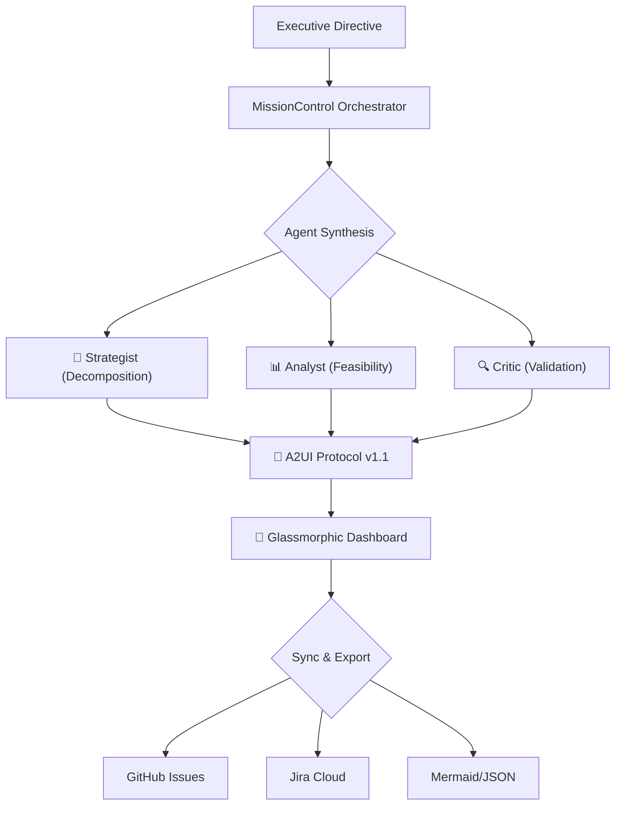

# 🌌 Atlas Strategic Agent v3.6.3


### *Executive Vision → Executable Enterprise Roadmaps*

**Atlas** is a production-ready multi-agent AI orchestrator that transforms high-level strategic directives into actionable 2026 quarterly roadmaps. Powered by **Google Gemini 2.0 Flash**, it features a collaborative "Mission Control" architecture with native GitHub Issues and Jira Cloud synchronization.

---

## 🎯 Executive Summary

Imagine you're a CEO who just declared, “I need to dominate the AI market in 2026!” Your leadership team nods enthusiastically—then everyone stares at each other wondering: *What does that actually mean? What do we build first? Who does what? When?*

**Atlas is the answer to that moment.**

It’s not just another project management tool. It’s an AI-powered reality check that transforms ambitious “change the world” statements into executable quarterly roadmaps—complete with tasks, dependencies, risk assessments, and timeline validation.

Think of it as three brutally honest consultants working 24/7:
*   **🎙️ The Strategist**: Breaks your vision into actionable pieces (milestones, dependencies).
*   **📊 The Analyst**: Asks, “Is this actually feasible?” (scoring, capacity, TaskBank alignment).
*   **🔍 The Critic**: Finds every flaw before reality does (DAG validation, acyclic constraints).

---

## 🏗️ Architecture: The Agent Development Kit (ADK)

Atlas implements a collaborative synthesis pipeline where specialized agents work together to ensure plan quality and technical feasibility.



### Specialized Agent Personas

| Agent | Role | Output |
| :--- | :--- | :--- |
| **🎙️ The Strategist** | Decomposes "North Star" goals into Q1-Q4 2026 workstreams | Strategic milestones with dependencies |
| **🔬 The Analyst** | Performs feasibility scoring and TASK_BANK alignment | Risk assessments and capacity analysis |
| **⚖️ The Critic** | Stress-tests roadmaps for acyclic graph validation | DAG optimization and quality scores |

---

## 🧱 Core Service Implementations

### 1. PersistenceService (`src/services/core/persistence.ts`)
- **Atomic Operations**: Uses a custom `Mutex` and non-recursive `processQueue` to handle asynchronous `localStorage` writes, preventing race conditions.
- **Security**: Implements XOR-based obfuscation (key `0xaa`) combined with Base64 encoding for client-side secret storage.
- **Quota Management**: Proactively monitors storage usage (5MB limit) and surfaces warnings when >90% capacity is reached.

### 2. MissionControl (`src/lib/adk/orchestrator.ts`)
- **Failure Simulation**: BFS-based engine that calculates impact cascades across the DAG, identifying high-priority risks.
- **Swarm Logic**: Orchestrates the multi-agent loop with iterative feedback until a quality threshold of **Score >= 85** is reached.
- **Agent Lifecycle**: `AgentFactory` manages a static pool of agents with automated disposal to prevent memory leaks.

### 3. Integration Layer (`src/services/integrations/`)
- **RetryableAPIService**: Base class providing exponential backoff and batch-based concurrency control (max 3 concurrent requests).
- **GitHub**: Automated milestone creation (Q1-Q4) and project board linking via `addToProject`.
- **Jira**: Bidirectional ticket discovery via encoded JQL and automated linking of stories to quarterly epics.

---

## 🧠 Technical Deep Dive & Tech Stack

### Why it works: The "Aha!" Moment
Executives are great at vision, but the gap between vision and execution is where strategies fail. Atlas was built to think like an experienced operator: **synthesize, validate, iterate, and challenge assumptions.**

### The Stack: Key Decisions
*   **TypeScript (Strict)**: 100% compliance. No `any`. Strict interfaces like `AnalystResult` ensure data integrity across the swarm.
*   **React 19**: Utilizes concurrent rendering for high-density dependency graphs.
*   **Vite 8.0**: Near-instant hot reload (~50ms) with optimized `manualChunks` for production.
*   **Tailwind CSS v4.2**: CSS-first configuration via `@theme`. Features a custom glassmorphic design system (`glass-1/2`).
*   **Gemini 2.0 Flash**: Selected for structured JSON output and low latency. Hardened `parseResponse` logic handles inconsistent LLM formatting.

### A2UI Protocol v1.1
Instead of returning raw data, the AI returns UI component schemas.
```json
{
  "type": "mission_control_status",
  "props": { "score": 92, "iterations": 2, "q1HighCount": 5 }
}
```
The `UIBuilder` fluent API allows agents to construct complex glassmorphic interfaces in real-time.

---

## 🧪 Development & Testing

### Available Scripts
```bash
npm run dev              # Start dev server (localhost:3000)
npm run build            # Production build with type checking
npm run lint             # ESLint Zero Warning check
npm run type-check       # Strict TypeScript check
npm test                 # Run Vitest suite
npm run coverage         # Coverage report (85% threshold)
```

### Testing Strategy
- **Threshold**: 85% coverage minimum across all metrics.
- **Infrastructure**: `src/test/setup.ts` handles global environment (Canvas, ResizeObserver, crypto) while `src/test/test-utils.ts` provides shared domain mocks.
- **Zero Warning Baseline**: Strict enforcement of 0 warnings across all dev scripts.

---

## ⚠️ Guardrails & Conventions

1.  **Zero Warning Baseline**: All PRs must pass `lint`, `type-check`, and `test` with 0 warnings.
2.  **Type Safety**: Avoid non-null assertions (`!`). Use proper null checks.
3.  **Fast Refresh**: Keep functional components separate from static constants (see `src/components/ui/TaskIcons.tsx`).
4.  **Security**: Use XOR-based obfuscation for secrets; never store raw API keys in plain text.
5.  **Acyclic DAGs**: The Critic agent strictly enforces no circular dependencies in the 2026 roadmap.

---

## 🗺️ Roadmap

### Current Version (v3.6.3) ✅
- **Zero Warning Baseline Achievement**: Restored 100% compliance across `lint`, `type-check`, and `test` suites.
- **Test Suite Modularization**: Decoupled `setup.ts` and introduced `src/test/test-utils.ts` for stable integration testing.
- **Neural Core Optimization**: Fixed asynchronous property access patterns in `GeminiService` for lower latency.
- **Fast Refresh & Modular UI**: Refactored icons and entry points for strict React 19 compatibility.

### Planned 🚀
- **V4.0.0**: Monte Carlo risk modeling with probability distributions.
- **V4.1.0**: Real-time collaborative synthesis via WebSockets.
- **V4.2.0**: Intelligent resource optimizer for headcount/budget.

---

## 📜 Changelog (v3.6.3 Highlights)

- **Fixed**: Vitest "failed to find the current suite" errors through `setup.ts` decoupling.
- **Fixed**: Asynchronous property access bug in `GeminiService.summarizeMission`.
- **Improved**: Standardized `ICONS` mocks to prevent React reconciliation errors.
- **Changed**: Moved UI logic to `src/components/ui/TaskIcons.tsx` for Fast Refresh compliance.
- **Hardened**: 100% strict TypeScript compliance across core ADK and persistence layers.

*For full history, see the archived `CHANGELOG.md`.*

---

<div align="center">

**Built with ❤️ by [Darshil Shah](https://github.com/darshil0)**

*Transforming executive vision into executable reality*

[Report Bug](https://github.com/darshil0/atlas-strategic-agent/issues) · [License: MIT](./LICENSE)

</div>
