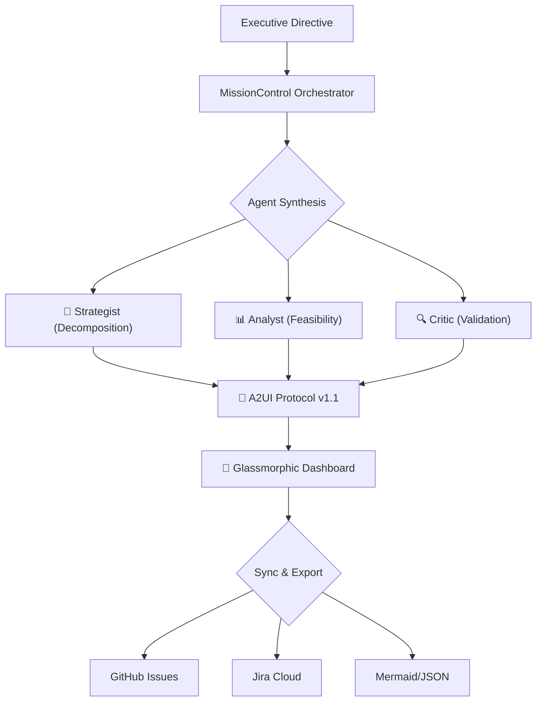

# 🌌 Atlas Strategic Agent v3.6.2


### *Executive Vision → Executable Enterprise Roadmaps*

**Atlas** is a production-ready multi-agent AI orchestrator that transforms high-level strategic directives into actionable 2026 quarterly roadmaps. Powered by **Google Gemini 2.0 Flash**, it features a collaborative "Mission Control" architecture with native GitHub Issues and Jira Cloud synchronization.

---

## 🎯 What Makes Atlas Different?

- **Multi-Agent Synthesis** - specialized Strategist, Analyst, and Critic agents collaborate in a real-time synthesis pipeline.
- **A2UI Protocol v1.1** - A high-performance protocol for streaming glassmorphic UI components directly from LLM reasoning.
- **What-If Simulations** - Advanced failure cascade modeling to visualize risk propagation and critical path bottlenecks.
- **Enterprise-Ready** - Seamless bidirectional synchronization with GitHub Issues API v3 and Jira Cloud REST API.
- **Premium UX** - A state-of-the-art glassmorphic interface built with React 19, Framer Motion 12, and Tailwind CSS v4.

---

## 🏗️ Architecture & Multi-Agent Engine

Atlas implements a collaborative synthesis pipeline where specialized agents work together to ensure plan quality and technical feasibility.



### Specialized Personas
| Agent | Role | Output |
|-------|------|--------|
| **🎙️ The Strategist** | Decomposes "North Star" goals into Q1-Q4 2026 workstreams | Strategic milestones with dependencies |
| **🔬 The Analyst** | Performs feasibility scoring and TASK_BANK alignment | Risk assessments and capacity analysis |
| **⚖️ The Critic** | Stress-tests roadmaps for acyclic graph validation | DAG optimization and quality scores |

> [!IMPORTANT]
> **Zero Warning Baseline**: v3.6.2 strictly enforces a zero-warning policy across TypeScript, ESLint, and Vitest, ensuring enterprise-grade stability.

---

## ✨ Key Capabilities

| Feature | Description | Stack |
|---------|-------------|-------|
| **A2UI Protocol** | Real-time streaming of UI from LLM responses | React 19 + Framer Motion |
| **What-If Engine** | Failure cascade modeling with risk scoring | Custom DAG analysis |
| **Enterprise Sync** | Native GitHub & Jira integration with ADF support | REST API v3 |
| **Glassmorphic UI** | Premium backdrop-blur design system | Tailwind 4.2 |
| **Persistence** | Mutex-guarded encrypted localStorage | Custom persistence layer |
| **TaskBank** | 90+ pre-calculated 2026 strategic objectives | AI, Cyber, ESG, etc. |

---

## 🚀 Getting Started

### Prerequisites
- **Node.js** 20+ (LTS recommended)
- **npm** 10+
- **Google Gemini API Key** ([Get your key](https://ai.google.dev/gemini-api/docs/api-key))

### Quick Start
```bash
# 1. Clone & Install
git clone https://github.com/darshil0/atlas-strategic-agent.git
cd atlas-strategic-agent
npm install

# 2. Environment Setup
cp .env.example .env
# Add your VITE_GEMINI_API_KEY to .env

# 3. Launch
npm run dev
```

The application will launch at `http://localhost:3000`.

### Environment Variables

| Variable | Required | Description |
| :--- | :--- | :--- |
| `VITE_GEMINI_API_KEY` | Yes | Google Gemini API Key |
| `VITE_GITHUB_TOKEN` | No | Personal Access Token for GitHub |
| `VITE_JIRA_DOMAIN` | No | Jira Cloud Domain (e.g. `company.atlassian.net`) |
| `VITE_JIRA_EMAIL` | No | Jira Account Email |
| `VITE_JIRA_API_TOKEN` | No | Jira API Token |

## 🚀 Deployment

To create a production build:

```bash
npm run build
```

The output will be in the `dist` directory. For production deployments, it is highly recommended to use a backend proxy for API keys to avoid exposing them in the client bundle.

### Content Security Policy (CSP)

Atlas includes a minimal CSP in `index.html`. If you use additional external resources, you may need to update the `connect-src` or `img-src` directives.

---

## 🧪 Development Workflow

### Available Scripts
```bash
npm run dev              # Start dev server
npm run build            # Production build with type checking
npm run preview          # Preview production build
npm run lint             # ESLint Zero Warning check
npm run type-check       # Strict TypeScript check
npm test                 # Run Vitest suite
npm run coverage         # Coverage report (85% threshold)
```

---

## 📂 Project Structure

```
src/
├── components/          # UI Components (ui/, views/, cards/, core/)
├── lib/adk/             # Agent Development Kit (Core)
├── services/            # Layered services (ai/, core/, integrations/)
├── config/              # System & Environment Configuration
├── data/                # Static Strategic Data (TaskBank)
├── types/               # Strict TypeScript Definitions
├── styles/              # Global Tailwind CSS-first Styles
└── test/                # Integration, Smoke & Unit Tests
```

---

## 🎨 Design System

Atlas features a custom glassmorphic theme designed for high-density strategic data:
- **Glass-1/2**: Backdrop-blur surfaces with dynamic lighting.
- **Typography**: Inter (UI), JetBrains Mono (Technical), Outfit (Display).
- **Theming**: Dark-first palette with `atlas-blue` accents.

---

## 🗺️ Roadmap

### Current Version (v3.6.2) ✅
- **Configuration Hardening**: Fixed all config file naming conventions (`.eslintrc`, `.gitignore`, etc.) for proper tool auto-discovery.
- **React 19 ESLint Compliance**: Added React-specific plugins (`eslint-plugin-react`, `eslint-plugin-react-hooks`, `eslint-plugin-react-refresh`) with strict Hook rules enforcement.
- **Test Configuration Consolidation**: Eliminated duplicate test configs between Vite and Vitest, establishing `vitest.config.ts` as single source of truth.
- **TypeScript Parser Enhancement**: Explicitly configured JSX support in ESLint parser for accurate linting.
- **Zero Warning Restoration**: Achieved full Zero Warning Baseline compliance across all configuration files.

### Previous Release (v3.6.1)
- **Type Safety Audit**: 100% strict compliance across all core modules (Zero Warning Baseline).
- **Memory Management**: Automated agent disposal in `AgentFactory`.
- **Persistence Layer**: Mutex-guarded `writeQueue` with non-recursive processing for data integrity.
- **Error Surface**: Detailed error extraction and UI reporting in `handleSend`.
- **Sync Enhancements**: Full GitHub Issue linking and Jira Epic mapping with exponential backoff.

### Planned 🚀
- **V4.0.0**: Monte Carlo risk modeling with probability distributions.
- **V4.1.0**: Real-time collaborative synthesis via WebSockets.
- **V4.2.0**: Intelligent resource optimizer for headcount/budget.

---

## 📚 Documentation
- **[AGENTS.md](./AGENTS.md)** - Multi-agent ADK reference.
- **[CHANGELOG.md](./CHANGELOG.md)** - Full version history.
- **[CONTRIBUTING.md](./CONTRIBUTING.md)** - Contribution guidelines.
- **[Technical Deep Dive](./docs/technical-deep-dive.md)** - Engineering insights.

---

## 📄 License
MIT License - See [LICENSE](./LICENSE) for details.

---

<div align="center">

**Built with ❤️ by [Darshil Shah](https://github.com/darshil0)**

*Transforming executive vision into executable reality*

[Report Bug](https://github.com/darshil0/atlas-strategic-agent/issues) · [Request Feature](https://github.com/darshil0/atlas-strategic-agent/issues)

</div>
